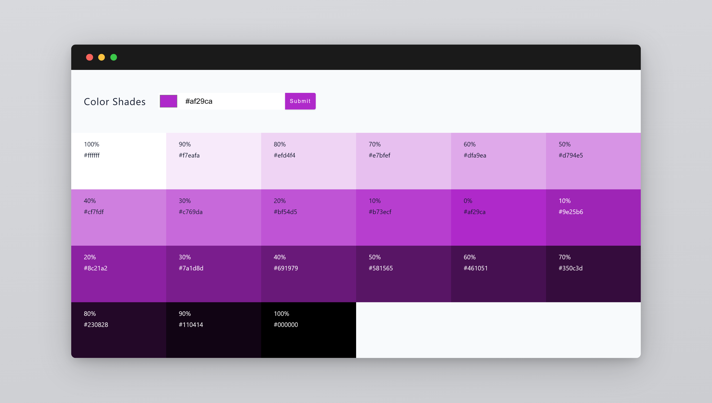

# 📌 ColorShades

**ColorShades** is a web-based application that allows users to input a hex color code and generate various shades of that color. Users can view the generated colors, see their hex values, and copy them to the clipboard.



---

## 🌐 Demo

Check out the live demo of ColorShades here:

**https://colorshades.dimmm.my.id**

---

## 🛠️ Key Features

| ✅ **Feature**              | 📌 **Description**                                              |
| -------------------------- | -------------------------------------------------------------- |
| **Color Input**             | Users can enter a hex color code using a text input or color picker |
| **Generate Shades**         | Generates multiple shades based on the input color using `values.js` |
| **Color List Display**      | Displays the generated shades with corresponding hex background colors |
| **Hex & Weight Display**    | Each color shows its hex value and weight (percentage) in the generated shade |
| **Copy to Clipboard**      | Users can click on a color to copy its hex value to the clipboard |
| **SweetAlert Notifications** | Displays success or error messages when copying colors to the clipboard using SweetAlert2 |

---

## ⚡ Installation & Setup

### **1️⃣ Clone Repository**

```sh
git clone https://github.com/username/ColorShades.git
cd ColorShades
```

### **2️⃣ Install Dependencies**

```sh
npm install
```

### **3️⃣ Run the Application**

```sh
npm start
```

Open in your browser: **[http://localhost:5173](http://localhost:5173)**

---

## 🎨 UI Features

| 📌 **UI Feature**             | 📌 **Description**                                          |
| ----------------------------  | ---------------------------------------------------------- |
| **Color Input Form**          | Input color with validation to ensure a valid hex format   |
| **Generated Color List**      | Shows the list of colors based on user input               |
| **Color Copy**                | Copy color to clipboard when clicked                       |
| **SweetAlert Notifications**       | Shows SweetAlert popups for success or failure of color copy  |

---
